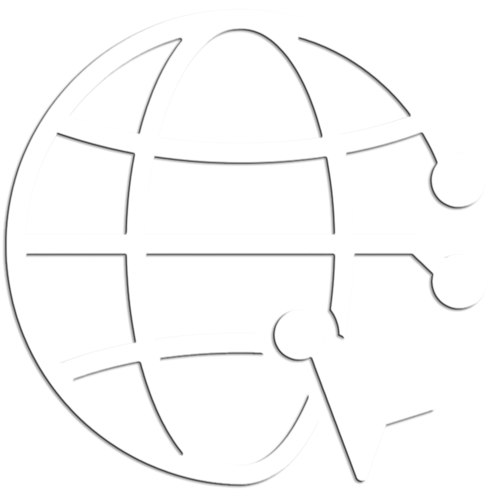

# 🖥️ smartWeb - 강인오 포트폴리오 & 웹 스터디

<div align="center">
  
  <h3>성실하게 배우고 성장하는 프론트엔드 & 콘텐츠 개발자 강인오의 개인 공간입니다.</h3>
  <p>HTML, CSS, JavaScript 기초부터 jQuery 활용, 그리고 독립된 온라인 이력서까지 포함된 포트폴리오 웹사이트입니다.</p>

  <p align="center">
    
    
    
    
    
  </p>
</div>

---

## 📌 주요 특징 (Key Features)

* **동적 페이지 로딩 (SPA 형태):**
  * 여러 HTML 파일을 분리해 관리하며, 메인 페이지(`index.html`)에서 jQuery `fetch` API를 사용하여 브라우저 새로고침 없이 부드럽게 화면을 전환합니다.
* **인터랙티브 기술 슬라이더 (Dynamic Carousel):**
  * 메인 화면에서 HTML, CSS, JavaScript, jQuery, GitHub 등 각 핵심 기술에 대한 소개 슬라이더가 10초 주기로 자동 전환되며, 하단 도트를 통한 수동 조작도 지원합니다.
* **반응형 테크 그리드:**
  * 화면 크기에 상관없이 최적의 레이아웃을 제공하는 그리드 시스템을 적용하였습니다.
* **프린트 최적화 온라인 이력서:**
  * A4 규격(210mm x 297mm)에 맞춘 깔끔한 디자인으로 PC 화면 보기뿐만 아니라 PDF 저장 및 인쇄 시에도 깨짐 없이 출력되는 독립된 [이력서 페이지](pages/resume.html)를 제공합니다.

---

## 🛠️ 기술 스택 (Tech Stack)

### **Frontend & Markup**
* **HTML5 / CSS3:** 시맨틱 마크업 설계 및 구조적인 스타일링 레이아웃 구현
* **JavaScript (ES6+):** 동적 콘텐츠 렌더링 및 비동기 페이지 Fetch 제어
* **jQuery (v3.7.1):** 선택자 및 이벤트 리스너의 효율적인 제어와 간결한 인터랙션 구현

### **Interest & Development Goals**
* **React / Node.js:** 컴포넌트 기반 프론트엔드 및 백엔드 개발 학습 중
* **Unity / C#:** 상호작용 가능한 콘텐츠 및 게임 개발 역량 보유

---

## 📂 프로젝트 구조 (Directory Structure)

```text
my_page/
├── index.html            # 메인 엔트리 페이지
├── README.md             # 프로젝트 소개 문서
├── css/                  # 디자인 스타일시트 폴더
│   ├── index.css         # 공통 및 메인 레이아웃 스타일
│   ├── contact.css       # 프로필 및 컨택트 페이지 스타일
│   ├── github.css        # Git 명령어 실습 페이지 스타일
│   └── [html/css/js/jquery].css  # 각 학습 콘텐츠 전용 스타일
├── js/                   # 자바스크립트 폴더
│   ├── pages.js          # 라우팅용 서브 페이지 경로 객체 정의
│   └── script.js         # 슬라이더 구현, 동적 페이징 및 이벤트 핸들러
├── images/               # 웹 이미지 자원 폴더
│   ├── logo.png          # 사이트 로고
│   ├── profile.png       # 개인 프로필 사진
│   ├── cells/            # 그리드용 테크 아이콘 이미지
│   ├── rect/             # 상세 페이지 헤더용 이미지
│   └── stack/            # 이력서 기술 스택 SVG 아이콘
└── pages/                # 비동기로 로드되는 HTML 서브 페이지들
    ├── home.html         # 메인 홈 대시보드
    ├── html.html         # HTML 학습 정리
    ├── css.html          # CSS 학습 정리
    ├── js.html           # JS 학습 정리
    ├── jquery.html       # jQuery 학습 정리
    ├── github.html       # Git & GitHub 활용 정리
    ├── contact.html      # 프로필 & 연락처 & 이력서 링크
    └── resume.html       # A4 규격 독립 이력서 문서
```

---

## 💻 실행 방법 (How to Run Locally)

본 프로젝트는 비동기 파일 로드(`fetch` API)를 사용하기 때문에, 보안 정책상 HTML 파일을 직접 더블 클릭(File URL scheme)하여 열면 CORS 오류가 발생할 수 있습니다. 로컬에서 실행 시 **웹 서버 환경**이 필요합니다.

1. **VS Code Live Server 확장 프로그램 사용 (추천):**
   * 프로젝트 폴더를 VS Code로 엽니다.
   * `index.html` 파일을 우클릭한 후 **[Open with Live Server]**를 선택합니다.
2. **Node.js (serve 패키지) 사용:**
   * 터미널을 열고 아래 명령어를 입력합니다:
     ```bash
     npx serve .
     ```
   * 출력되는 로컬 주소(`http://localhost:3000` 등)로 접속합니다.

---

## 🚀 배포 (Deployment)

본 프로젝트는 **GitHub Pages**를 통해 호스팅되고 있습니다.

* **배포 브랜치:** `main` (root)
* **배포 URL:** [https://gasshot.github.io/my_page/](https://gasshot.github.io/my_page/)
* **배포 최적화 조치:** 
  * 파일 및 리소스의 모든 경로를 상대 경로로 구성하여 서브 디렉토리 구조에서도 완벽하게 로드되도록 설계하였습니다.
  * 대소문자를 구분하는 리눅스 웹 호스팅 환경을 고려하여 모든 확장자를 소문자(`.png`)로 통일하였습니다.

---

<p align="center">
  © 2026 강인오. Designed & Built with ❤️
</p>
